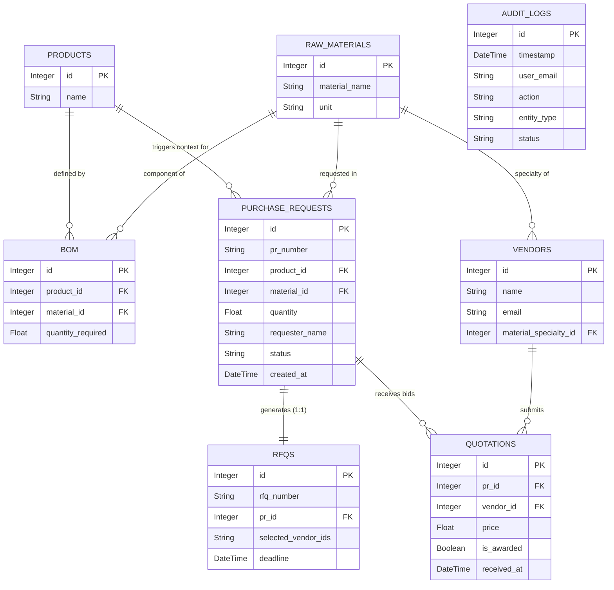

````markdown
# 🗄️ Database Architecture & Entity Design: Smart Procurement System

## 1. Architectural Overview

The database architecture of the **Smart Procurement System (SPS)** is designed around strict relational integrity. Built using **SQLAlchemy ORM**, the schema guarantees a "Single Source of Truth" by tightly coupling production requirements (BOM) with procurement execution (PRs, RFQs, and Quotations) while maintaining complete system accountability through an immutable Audit Log.

---

## 2. Core Entities (Data Dictionary)

### 📦 Manufacturing Data Layer

- **`Product` (`products`):** Represents the final manufactured goods. Serves as the parent entity for material planning.
- **`RawMaterial` (`raw_materials`):** The master directory of all individual components and resources used in the factory, including their unit of measurement.
- **`BOM` (`bom` - Bill of Materials):** The critical junction table. It defines the exact formulation by linking a specific `Product` to its required `RawMaterial` along with the `quantity_required`.

### 🛒 Procurement Execution Layer

- **`PurchaseRequest` (`purchase_requests`):** The operational anchor of the system. Generated when materials are needed, it links directly to both the `Product` and `RawMaterial` to justify the demand. It tracks the digital lifecycle via the `status` field (e.g., Pending, RFQ Sent, Closed).
- **`Vendor` (`vendors`):** The supplier directory. Each vendor is strategically linked to a specific material specialty (`material_specialty_id`), enabling targeted RFQ dispatching.
- **`RFQ` (`rfqs`):** The outbound procurement document. It has a strict one-to-one relationship with a PR. It stores dispatch instructions and the array of invited vendors (`selected_vendor_ids`).
- **`Quotation` (`quotations`):** The inbound response entity. It logs the exact `price` offered by a specific `Vendor` for a specific `PR`. The `is_awarded` boolean flag is used by management to finalize the financial decision.

### 🛡️ Governance & Security Layer

- **`AuditLog` (`audit_logs`):** An append-only, system-wide ledger. It tracks `user_email`, `action` (CREATE, UPDATE, DELETE), and the `entity_type` affected, ensuring total operational transparency and GRC compliance.

---

## 3. Entity Relationship Logic

The business logic is enforced at the database level through the following relationships:

1. **Many-to-Many via BOM:** `Products` and `RawMaterials` share a many-to-many relationship bridged by the `BOM` table. One product requires many materials, and one material can be used in many products.
2. **One-to-One Procurement Trigger:** One `PurchaseRequest` generates exactly one `RFQ` event.
3. **One-to-Many Bidding Matrix:** A single `PurchaseRequest` can receive multiple `Quotations` (bids) from different `Vendors`, allowing the system to build a side-by-side cost comparison terminal.
4. **Specialized Vendor Mapping:** A `Vendor` is mapped to a specific `RawMaterial` (Specialty), streamlining the vendor selection process during the RFQ phase.

---

## 4. Entity Relationship Diagram (ERD)

_The following ERD maps the exact database schema, primary keys (PK), foreign keys (FK), and cardinality based on the SQLAlchemy models._


````

---

**Data Architecture by:** Mohammed Hlal
**Tech Stack:** SQLAlchemy | Relational DB (SQLite/PostgreSQL) | Mermaid ERD

```

```
