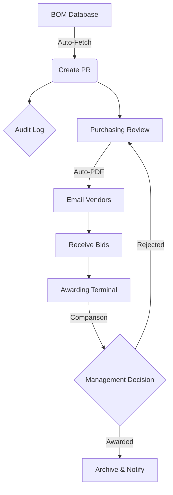

# 📋 Project Executive Summary: Smart Procurement System (SPS)

## 1. Executive Summary

The **Smart Procurement System (SPS)** is a bespoke digital transformation solution designed to migrate traditional, manual procurement workflows into a streamlined, automated, and auditable digital engine. By integrating **Bill of Materials (BOM)** logic with automated **Request for Quotation (RFQ)** dispatching, the system eliminates operational friction, minimizes manual errors, and ensures 100% data integrity across the supply chain lifecycle.

---

## 2. Current Challenges (The Problem)

In the legacy manual operating model, the procurement cycle suffered from significant operational bottlenecks:

- **Administrative Overhead:** High manual effort required for drafting PRs and RFQs via fragmented Word/Excel files.
- **Information Asymmetry:** Disconnected data between production requirements (BOM) and actual purchasing actions.
- **Risk of Human Error:** Manual price comparisons and data entry increased the likelihood of financial discrepancies.
- **Accountability Gaps:** Lack of a centralized, immutable record to track "who authorized what and when."

---

## 3. Proposed Digital Process: The Future State

The proposed digital transformation replaces fragmented manual tasks with a **Linear, Automated, and Monitored Workflow**. This ensures that data flows seamlessly from the factory floor to the management's decision-making terminal.

### 🔄 The Digital Workflow Step-by-Step

| Step   | Phase                  | Digital Action                                                                                                    |
| :----- | :--------------------- | :---------------------------------------------------------------------------------------------------------------- |
| **01** | **Demand Capture**     | System auto-retrieves material requirements via **BOM Integration**, preventing manual calculation errors.        |
| **02** | **PR Generation**      | A structured **Purchase Request (PR)** is created with a unique ID, automatically timestamped and logged.         |
| **03** | **Smart Dispatching**  | Purchasing Team triggers **Automated Emailing** with system-generated PDF RFQs to selected vendors.               |
| **04** | **Bid Consolidation**  | Vendor responses are entered into a central **Awarding Terminal** for side-by-side comparison.                    |
| **05** | **One-Click Awarding** | Management reviews and clicks **"Confirm Award"**; the system archives the transaction and notifies stakeholders. |
| **06** | **Continuous Audit**   | Every step is silently monitored by the **Logger Service**, ensuring a 100% transparent "Digital Paper Trail."    |

### 📉 System Flow Diagram



````

### 🎯 Key Improvements in the Future State

- **Predictability:** Management can forecast material needs based on the BOM instead of guessing.
- **Speed:** Tasks that previously took days (e.g., drafting 10 RFQs for 10 vendors) now take **seconds**.
- **Data Integrity:** The "Human Factor" is minimized; the system handles the heavy lifting of data transfer between documents.
- **Institutional Memory:** The system retains the full history of every PR, RFQ, and Awarding decision, even after staff turnover.

---

## 4. Audit & Governance (GRC)

A cornerstone of this project is the **Advanced Audit Logging Service**, designed to ensure 100% operational transparency:

- **Immutable Activity Tracking:** Every system interaction (PR Creation, Email Sent, Bid Awarded, Record Modified) is timestamped and logged.
- **Security & Transparency:** The system creates a permanent "Digital Footprint" for every action, preventing unauthorized or unrecorded changes.
- **Technical Resilience:** Dual-layer logging (Database + System Error Files) ensures that the audit history remains intact even during technical failures.

---

## 5. Strategic Business Impact

| Metric                | Impact Description                                                                        |
| :-------------------- | :---------------------------------------------------------------------------------------- |
| **Operational Speed** | Up to **70% reduction** in time spent on RFQ preparation and vendor communication.        |
| **Data Accuracy**     | **Zero discrepancy** between production requirements (BOM) and purchase orders.           |
| **Cost Saving**       | Enhanced ability to select the "Best Value" bid through structured, real-time comparison. |
| **Transparency**      | Immediate access to historical logs for management reviews and internal audits.           |

---

## 6. Future Roadmap

The system is architected for scalability, with the following enhancements proposed:

- **Phase 2:** Implementation of secure **User Authentication & RBAC** (Role-Based Access Control).
- **Phase 3:** Integration of **AI-Driven Analytics** for price trend prediction and vendor scoring.
- **Phase 4:** Development of a **Supplier Portal** for direct, paperless bid submissions.

---

**Digital Consultant:** Mohammed Hlal
**Technical Stack:** Python | Streamlit | SQLAlchemy | SMTP Integration | Mermaid.js

```

```

````
