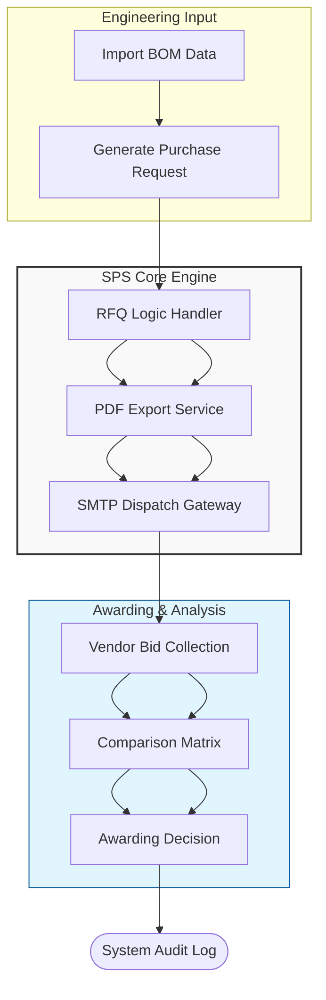

# 🚀 Smart Procurement System (SPS) v1.0

An industrial-grade MVP designed to bridge the gap between production engineering and supply chain execution through automated intelligence and BOM-driven workflows.

[](https://www.python.org/)
[](https://streamlit.io/)
[](https://www.sqlalchemy.org/)
[](https://opensource.org/licenses/MIT)

---

## 📌 Executive Overview

The **Smart Procurement System (SPS)** is a professional digital engine tailored for manufacturing environments. It transforms manual, error-prone procurement into a centralized, data-driven process. By integrating **Bill of Materials (BOM)** requirements directly with automated **RFQ dispatching**, SPS ensures that every component needed on the production floor is sourced with 100% traceability, optimized pricing, and minimal operational lag.

---

## 🏗️ Engineering & Strategic Documentation

To provide a 360-degree view of the system's architecture and business value, the project is documented across four strategic pillars:

1. **[Strategic Project Summary](./PROJECT_SUMMARY.md)**: Business case, ROI analysis, and current-state vs. future-state gap analysis.
2. **[Solution Architecture](./Solution_architecture.md)**: Deep dive into the N-Tier architecture, logic handlers, and component interactions.
3. **[Database Design](./Database_design.md)**: ERD schemas and relational integrity constraints using SQLAlchemy ORM.
4. **[Technology Rationale](./Technology_rationale.md)**: Technical justification for the chosen stack (Streamlit, SQLite, SMTP Gateway).

---

## 📁 Project Structure

```text
.
├── database/           # DB connection & Session management (SQLAlchemy)
├── models/             # Data entities (BOM, RFQ, Vendor, User)
├── services/           # Business logic: RFQ Generation & SMTP Mailer
├── utils/              # PDF Generators & Data formatting helpers
├── views/              # Streamlit UI Components & Pages
├── rfq_archive/        # Local storage for generated PDF audit trails
├── .env.example        # Environment configuration template
├── app.py              # Application entry point
└── requirements.txt    # Production dependencies
```

---

## ✨ Key Features

- **BOM-Driven Intelligence:** Automated derivation of procurement needs from complex production Bill of Materials.
- **Automated RFQ Engine:** Dynamic PDF generation and direct dispatch to vendors via secure SMTP protocols.
- **Strategic Awarding Terminal:** Multi-vendor bid comparison matrix for data-backed awarding decisions.
- **Immutable Audit Trail:** Full transparency and GRC compliance for every system action.
- **Vendor Specialization:** Intelligent vendor-to-material mapping to optimize sourcing quality.

---

## 📊 System Flow at a Glance



---

## 🛠️ Installation & Setup

### 1. Environment Setup

1. **Clone the Repository:**

   ```bash
   git clone [https://github.com/your-username/smart-procurement-system.git](https://github.com/your-username/smart-procurement-system.git)
   cd smart-procurement-system
   ```

2. **Initialize Environment:**
   ```bash
   python -m venv venv
   source venv/bin/activate  # On Windows: .\venv\Scripts\activate
   ```

### 2. Configuration

Create a `.env` file from the provided template:

```bash
cp .env.example .env
```

Update the `.env` file with your SMTP credentials (`SENDER_EMAIL`, `SENDER_PASSWORD`, etc.).

### 3. Deployment

```bash
pip install -r requirements.txt
streamlit run app.py
```

---

## 🚀 Future Roadmap

- **Phase 2 (Security):** Role-Based Access Control (RBAC) & OAuth2 Integration.
- **Phase 3 (Intelligence):** Predictive Lead-Time Analytics using historical vendor performance.
- **Phase 4 (Integration):** Supplier Self-Service Portal for direct bid entry.

---

## 🤝 Contact & Collaboration

**Digital Consultant:** Mohammed Hlal
**LinkedIn:** [Mohammed Hlal Profile](https://www.linkedin.com/in/mohamed-hlal-288206334/)

_This project is engineered to meet the highest standards of operational excellence and digital scalability in the procurement domain._

```

```
