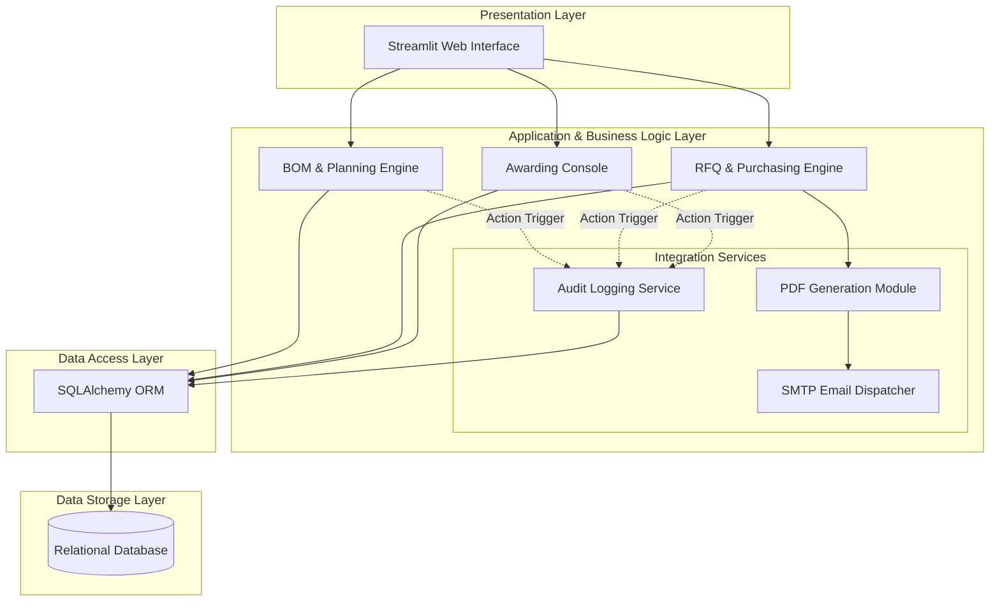

# 🏛️ Solution Architecture: Smart Procurement System (MVP)

## 1. Architectural Overview

The **Smart Procurement System (SPS)** MVP is built on a robust, modular **N-Tier Architecture**. This design ensures a clear separation of concerns between the user interface, business logic, external services (Email/PDF), and data storage. The architecture is engineered for high cohesion, low coupling, and rapid scalability, making it an enterprise-ready foundation.

---

## 2. High-Level Architecture Diagram

The following diagram illustrates the flow of data and control between the system's core layers and micro-services.



---

## 3. Core Components Breakdown

### 🖥️ 3.1 Presentation Layer (User Interface)

- **Technology:** `Streamlit` (Python)
- **Functionality:** Serves as the interactive frontend. It is divided into distinct, role-based dashboards (Planning, Purchasing, Awarding, Master Data). It handles user inputs, displays dynamic data tables, and triggers backend services instantly without complex state management.

### ⚙️ 3.2 Application Logic Layer (Backend Services)

The core "Brain" of the application, consisting of modular Python services:

- **BOM & Planning Engine:** Intercepts production requests, queries the Bill of Materials, and mathematically calculates the exact required raw materials, auto-generating Purchase Requests (PRs).
- **RFQ Engine:** Manages the supplier bidding lifecycle. It aggregates PRs and assigns them to specific vendors based on their material specialties.
- **Awarding Console:** An analytical module that retrieves all received quotations for a specific PR, processes the financial data, and presents a side-by-side comparison matrix to determine the "Best Value" bid.

### 🔌 3.3 Integration & Utility Services

To bridge the gap between digital data and real-world communication, the system utilizes dedicated utility modules:

- **PDF Generation Module:** Dynamically renders structured, professional PDF documents (e.g., Request for Quotation documents) using real-time database inputs.
- **SMTP Email Dispatcher:** An automated communication gateway. It takes the generated PDF, attaches it to a pre-formatted email template, and dispatches it directly to the vendor's registered email address.
- **Audit Logging Service:** A background observer service. Every data-mutating action (Create, Update, Delete, Dispatch) calls this service to record the user, timestamp, and action details, ensuring full traceability.

### 💾 3.4 Data Access & Storage Layer

- **Data Access (ORM):** `SQLAlchemy` is utilized to map Python objects (Entities) to database tables. This abstracts raw SQL queries, prevents SQL injection, and ensures strict data validation before committing to the database.
- **Data Storage:** A Relational Database Management System (e.g., `SQLite` for MVP, scalable to `PostgreSQL` for production). It enforces referential integrity through foreign keys, ensuring that PRs, RFQs, and Vendors remain perfectly synchronized with the Master Data.

---

## 4. Technical Stack Summary

| Component           | Technology / Library    | Purpose                                          |
| :------------------ | :---------------------- | :----------------------------------------------- |
| **Frontend/UI**     | `Streamlit`             | Rapid deployment of data-driven user interfaces. |
| **Backend Logic**   | `Python 3.x`            | Core programming language for business rules.    |
| **ORM**             | `SQLAlchemy`            | Secure and structured database transactions.     |
| **Database**        | `SQLite` / `PostgreSQL` | Relational data persistence and integrity.       |
| **Document Engine** | `ReportLab` / `FPDF`    | Dynamic rendering of RFQ PDF files.              |
| **Comms Gateway**   | `smtplib`               | Automated email dispatching to vendors.          |
| **Architecture**    | `Mermaid.js`            | Code-based architectural visualization.          |

---

**Lead Architect:** Mohammed Hlal
**Project:** Smart Procurement System (SPS)

```

```
